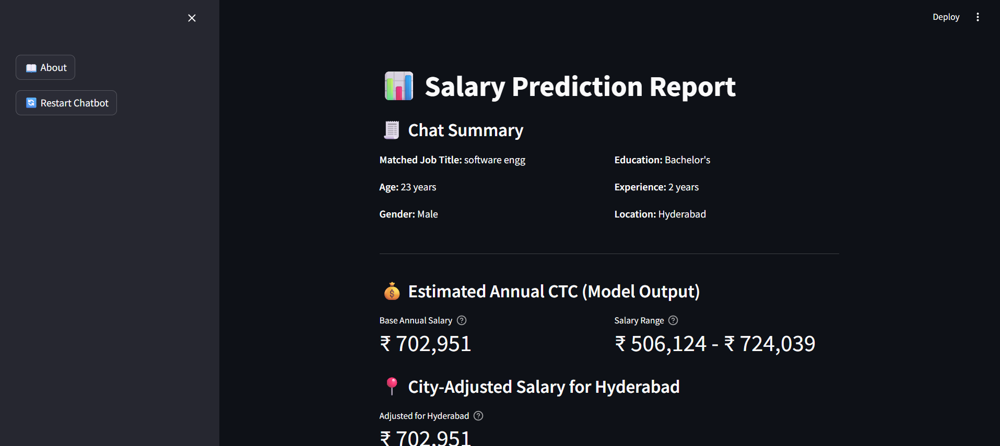
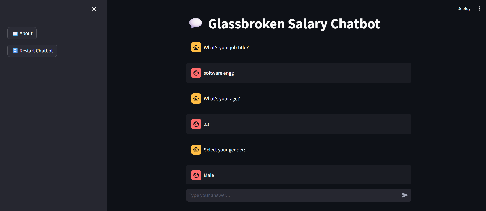
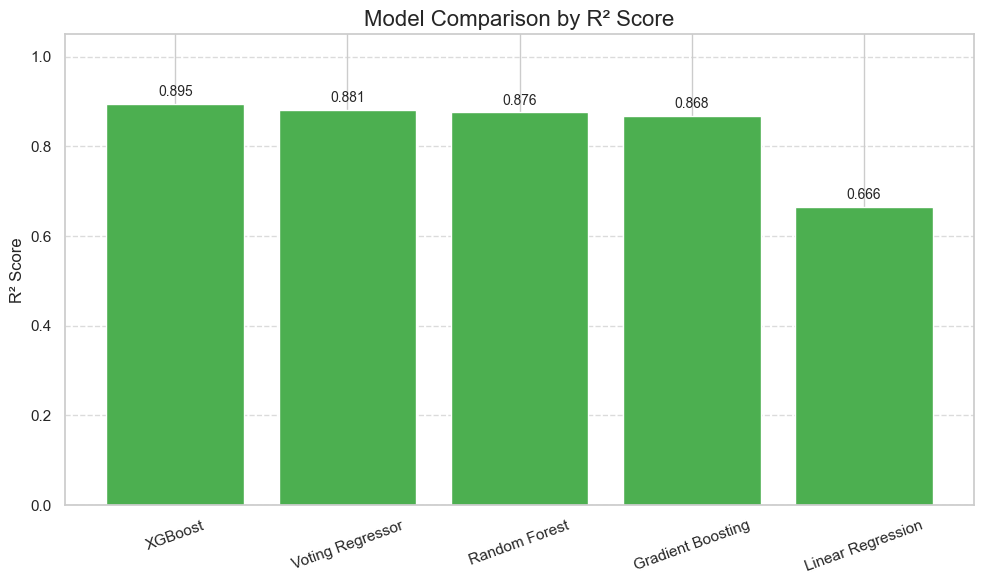

# GlassBroken: AI-Powered Salary Prediction Chatbot

## End-to-End ML Project | Streamlit UI + XGBoost + NLP | Internship with EDUNET Foundation (IBM SkillBuild)

## 🧠 Project Overview

**GlassBroken** is a smart, conversational salary advisor app that collects user data through a chatbot interface and uses machine learning to predict salaries with city-based cost-of-living adjustments.

Job seekers often lack reliable, personalized salary guidance. GlassBroken solves this by providing accurate salary predictions through an intuitive chat interface.

---

## 🧰 Tech Stack

| Layer    | Tools Used                              |
|----------|-----------------------------------------|
| Frontend | Streamlit, Plotly, streamlit-chat, Lottie |
| ML Model | XGBoost Regressor, Scikit-learn, Joblib |
| NLP      | RapidFuzz, Rule-based NLP              |
| Backend  | Python, Pandas, NumPy                  |

---

## 🔑 Key Features

✅ Conversational chatbot for user input  
✅ Fuzzy job title matching using RapidFuzz  
✅ XGBoost regressor for salary prediction  
✅ City-based cost-of-living adjustments  
✅ Interactive dashboard with charts

---

## 📈 Model Performance

| Model            | R² Score | MAE (₹) | RMSE (₹) |
|------------------|----------|---------|----------|
| **XGBoost**      | **0.89** | 11,485  | 17,087   |
| Voting Regressor | 0.88     | 12,303  | 17,760   |
| Gradient Boosting| 0.87     | 13,314  | 18,642   |
| Linear Regression| 0.76     | 19,278  | 25,364   |

---

## 👨‍💻 Author

**Mohit Singh**  
📧 mohitshekhawat2323@gmail.com  
🔗 [LinkedIn](https://www.linkedin.com/in/mohit-singh-a64848258/)
